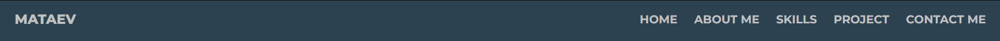
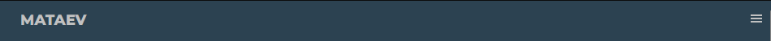
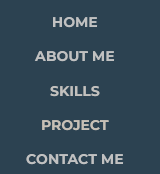
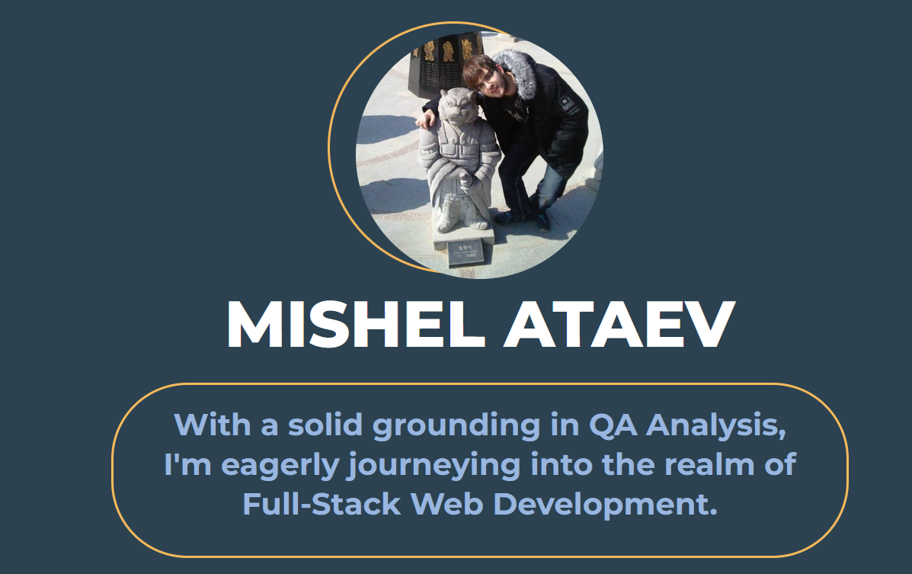
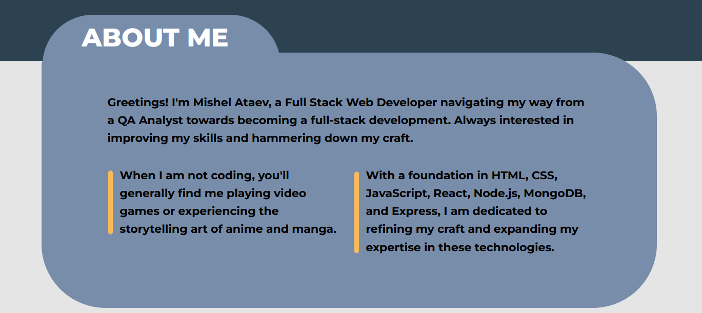
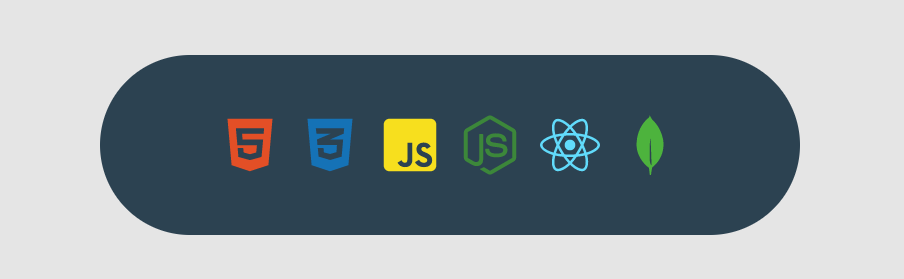
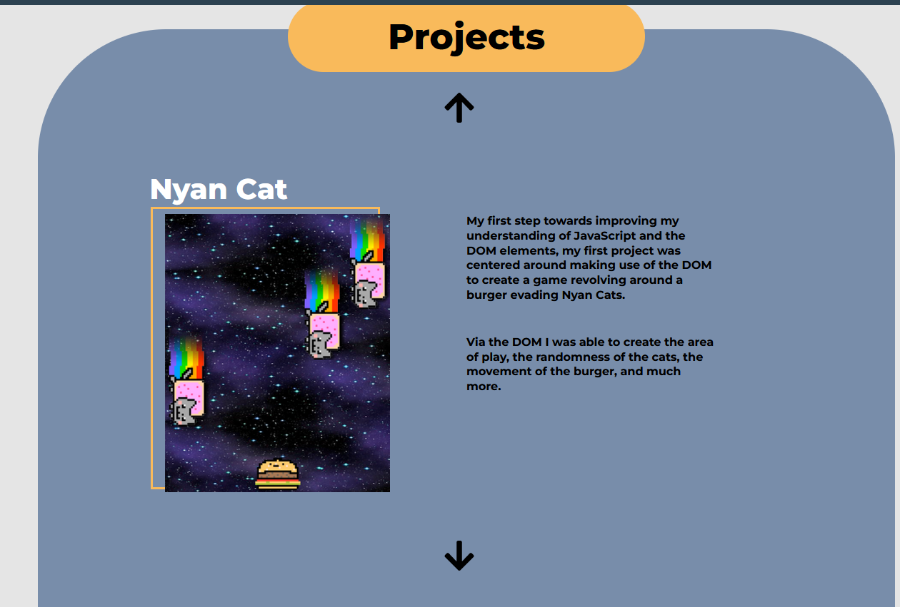
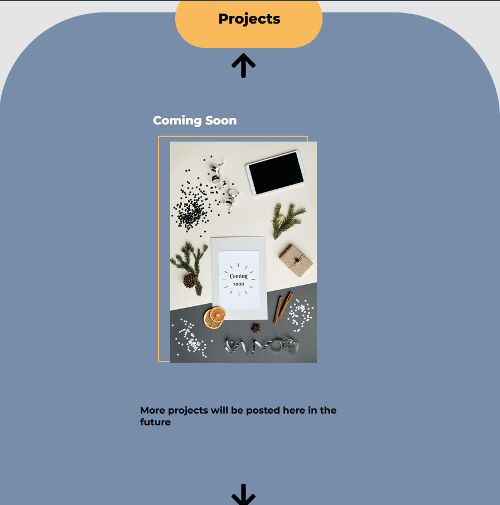

# Portfolio

## Introduction
Welcome to my Personal Portfolio page.

This showcases my work and my knowledge from the past couple months of learning web development. 

This project was a great opportunity for me, as it allowed me to showcase the skills I have learned from the previous months, as well as learn new skills, and was a great process in learning the process of finding new packages on my own.

## Technologies Used
- HTML, CSS, JavaScript
- React
- Styled Components 
- Git/GitHub for version control

## Portfolio Sections
### Navigation Bar

Here we have the navigation bar for the page, when pressing any of the options on the right side, it will bring you to the section.

When the resolution of the monitor / device is below 1024px in width, the menu options will disappear and a burger menu will appear instead that when clicked will spawn a menu to move around between.

### Hero Section

This is the hero section of my page with a profile picture of myself as well as a brief explanation about me.

### About Me Section

This is the about me section of my portfolio going more into detail of who I am as a person, and what I like doing.

### Skills

This section is focused on the skills I have learned throughout my first couple of months as a web developper and I will be looking to add more as I further my journey.

### Projects

This is a section showcasing the projects I have currently worked on, it has a responsive elemenet that changes the grid to be a column with only 1 row. to make it more mobile / tablet friendly.

### Contact Me

Finally this is the section on how one could contact me, by pressing the buttons with the images they are linked to my Linkedin, GitHub or can send directly an email to me.

## Conclusion
I really enjoyed working on my Portfolio and will definetly look to improve upon it as there are some elements I really feel my lack of knowledge is being showcased.
